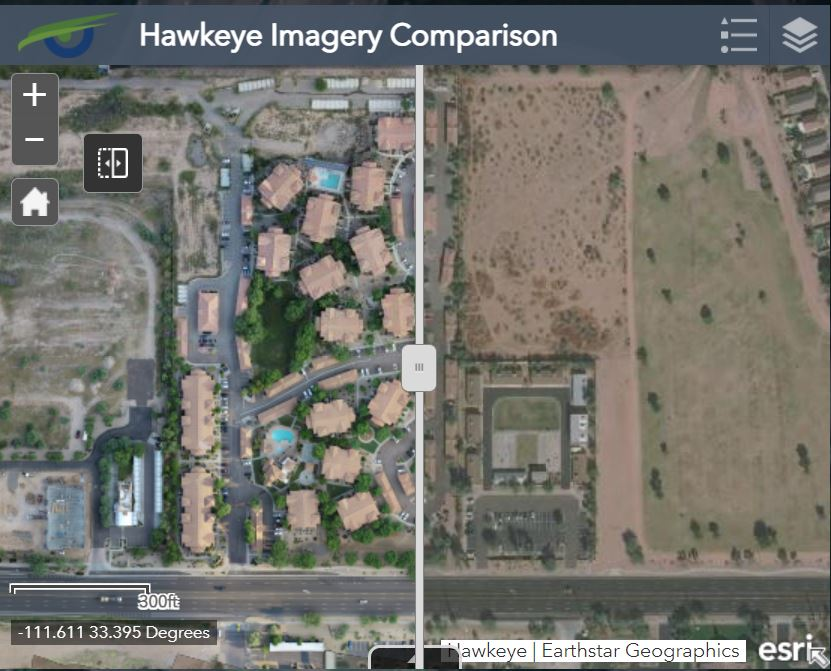
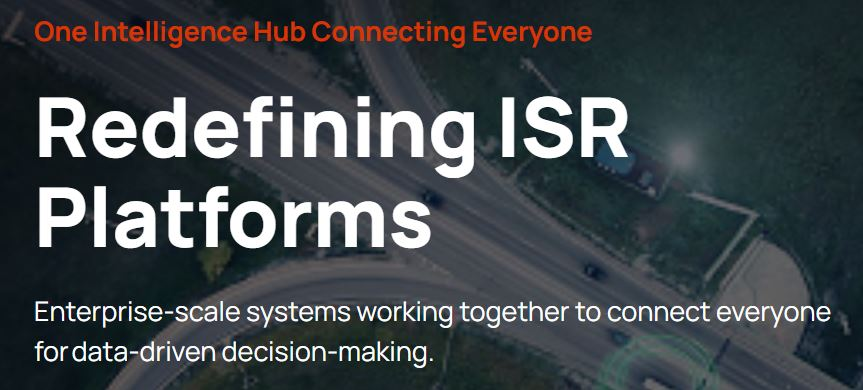
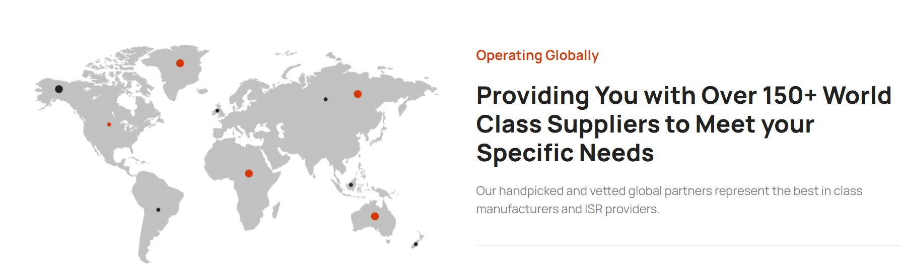
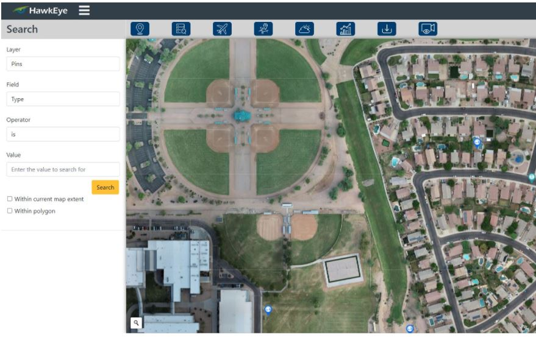

We Specialize in Providing Intelligence in Austere Environments
We provide a state-of-the-art intelligence platform including live drone flights, surveillance capabilities, and world-class imagery. 

We’ve integrated an array of systems to ensure your operation has the data it needs at every moment.

## Unique ISR capabilities


### Live Object Tracking 
Automatically track items such as vehicles, people, or animals
### Flight Planning
Advanced flight planning submission, capabilities, and viewing
### In-Depth Analytics
Gather analytical insights based on possible threats & illegal activity
### Anti Jamming Capabilities
Ensuring you retain control over drones in your airspace



### Fixed Security Camera Integration
Combine all security cameras into one common viewing platform, regardless of provider
### Full HD Live Video Streaming
Stream live drone feeds to your command center in real-time



### We Take Intelligence Shortfalls and Remove the Deficits

### 3-cm Imagery Mapping Service
### UAV Integration
### UAV Consulting
### 24/7/365 Pilots-As-A-Service
### Intelligence Analysis
### One Centralized Hub
## Deployment

To deploy this project run

```bash
  npm start
```

  
## FAQ

#### Question 1 Do you provide 24/7 services?

Answer Yeah we provide 24/7 services.

#### Question 2 is your hub centralized?

Answer 2 Yes our hub is centralized.


  
## 🛠 Skills
Javascript, HTML, CSS...

https://github.com/hawkeye-intl

  
## Documentation

[Documentation]

  
## Feedback

If you have any feedback, please reach out to us at our email info@hawkeye-intl.com

  


    
## Tech Stack

**Client:** React, Redux, TailwindCSS

**Server:** Node, Express

  
## Support

For support, you can contact us at our email info@hawkeye-intl.com

## Demo

Contact us for demo

## Website

https://hawkeye-intl.com/

## App Screenshot



  
## Roadmap

- Additional browser support

  
## Used By

This project is used by the following companies:

- HawkEye INL

  
